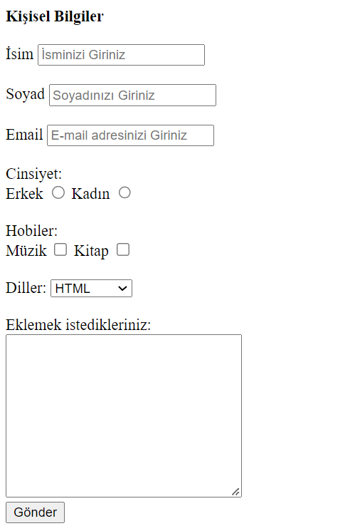

# Turkcell Geleceği Yazanlar 2.Hafta

`Konu hakkında kısa özetler ve faydalı linkler verilecektir 😉`

### HTML Semantik Etiketler

[HTML-Semantik-Etiketler](https://www.yusufsezer.com.tr/html5-semantik-etiketler/)( Yusuf abinin sitesine bayılıyorum, bu yazı da çok sade ve güzel bir özet olmuş )


<!-- <hr size="1" noshade> -->

### HTML Tables

[HTML Tables: All there is to know about them](https://medium.com/free-code-camp/html-tables-all-there-is-to-know-about-them-d1245980ef96)
[W3Schools](https://www.w3schools.com/html/html_tables.asp) ( Tabloları çok fazla kullanmayacağız fakat takıldığında buraya uğra 😉 )

### HTML Form Etiketleri

[Prototürk-Form-Etiketleri](https://prototurk.com/html/form-etiketleri)

### Örnek İletişim Formu (2.Hafta Grup Çalışması)



```
<form>
      <label for="name">İsim</label>
      <input type="text" placeholder="İsminizi Giriniz" name="name" id="name" />
      <br />
      <br />
      <label for="surname">Soyad</label>
      <input type="text" placeholder="Soyadınızı Giriniz" name="surname" id="surname" />
      <br />
      <br />
      <label for="email">Email</label>
      <input type="email" placeholder="E-mail adresinizi Giriniz" name="email" id="email" />
      <br />
      <br />
      <label>Cinsiyet:</label> <br />
      <label for="erkek">Erkek</label>
      <input type="radio" name="cinsiyet" value="erkek" id="erkek" />
      <label for="kadın">Kadın</label>
      <input type="radio" name="cinsiyet" value="kadın" id="kadın" />
      <br />
      <br />
      <label>Hobiler:</label>
      <br />

      <label for="music">Müzik</label>
      <input type="checkbox" name="hobbies" value="müzik" id="music" />

      <label for="book">Kitap</label>
      <input type="checkbox" name="hobbies" value="kitap" id="book" />
      <br />
      <br />
      Diller:
      <select name="languages" id="languages">
        <option value="">HTML</option>
        <option value="">CSS</option>
        <option value="">Javascript</option>
      </select>
      <br />
      <br />

      Eklemek istedikleriniz: <br />

      <textarea name="anyidea" id="anyidea" cols="30" rows="10"></textarea>

      <br />
      <button type="submit">Gönder</button>
    </form>

```
